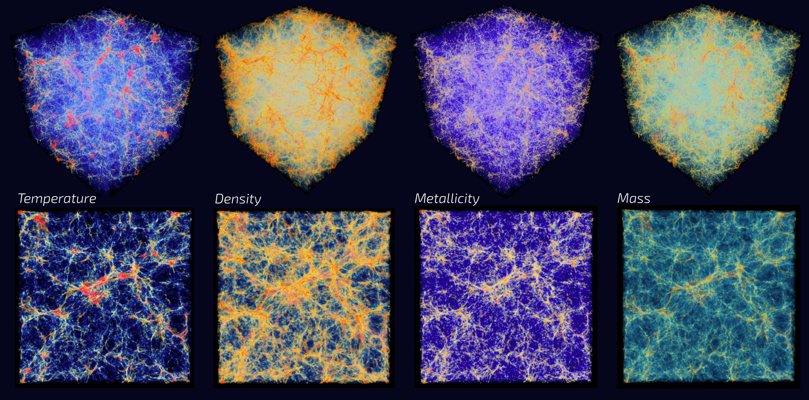

# Welcome to CosmoVis!

We introduce CosmoVis, an open-source web-based astrophysics visualization tool that facilitates the interactive analysis
of large-scale hydrodynamic cosmological simulation datasets. CosmoVis enables astrophysicists as well as citizen scientists to share and explore these datasets, which are often comprised of complex, unwieldy data structures greater that 1 TB in size. Our tool visualizes a range of salient gas, dark matter, and stellar attributes extracted from the source simulations, and enables further analysis of the data using observational analogues, specifically absorption line spectroscopy. CosmoVis introduces novel analysis functionality through the use of **virtual skewers** that define a sightline through the volume to quickly obtain detailed diagnostics about the gaseous medium along the path of the skewer, including synthetic spectra that can be used to make direct comparisons with observational datasets. We identify the main analysis tasks that CosmoVis enables, and evaluate the software by presenting a series of contemporary scientific use cases that utilize CosmoVis. Additionally, we conduct a series of task-based interviews with astrophysicists indicating the usefulness of CosmoVis for a range of data analysis tasks.

A live demo can be found here: [CosmoVis](http://cosmovis.nrp-nautilus.io)

A dev demo with experimental features can be found here: [CosmoVis](http://cosmovis-dev.nrp-nautilus.io)

Here is a video that outlines a scientific use case from CosmoVis: [link](https://drive.google.com/file/d/1CPoEFf4xyQHr0zxEZMu_VgkT2a0_Nfme/view?usp=sharing)

## Installation Instructions
CosmoVis can be configured to run locally or remotely on a server, but the most simple way is to have it run locally. Hosting has the benefit of being able to access the visualization from other devices, and only takes a few extra steps to configure. CosmoVis has been tested on Windows, Linux and Mac.

To get started, install Python 3.7+ if you do not have it already (CosmoVis was built with version 3.8.5). It is helpful to create a new environment using Conda, but it is not necessary. There are a few specific Python packages that need to be installed:

	$ pip install eventlet==0.25.2 Flask==1.1.2 Flask-SocketIO==4.3.0 Frozen-Flask==0.15 python-engineio==3.13.0 python-socketio==5.6.0 mpi4py numpy cython git

Note: in order to install mpi4py, you may need to install a version of MPI on your machine, such as OpenMPI.

In addition, the development versions of yt, trident and yt-astro-analysis must be installed (in that order):

    $ git clone https://github.com/yt-project/yt.git yt
    $ cd yt
    $ pip install -e .
    $ cd ..
    
    $ git clone https://github.com/trident-project/trident.git trident
    $ cd trident
    $ pip install -e .
    $ cd ..
    
    $ git clone https://github.com/yt-project/yt_astro_analysis.git yt_astro_analysis
    $ cd yt_astro_analysis
    $ pip install -e .
    $ cd ..

To finish installing Trident, open Python in the terminal and import Trident.

    $ python
    > import trident
  
  The first time Trident runs an installation dialogue appears. Follow the on screen instructions and verify that is has been installed successfully by typing:
  
    > trident.verify()

Alternatively, one can use the included requirements.txt file to install Python dependencies:
	
	`pip install -r requirements.txt`

## Running CosmoVis
- In the terminal, cd into the CosmoVis folder and type `python cosmo-serv.py`
- Once the application starts, wait for the data to finish loading and in the web browser go to `localhost:5000`
- If the webpage does not load, try doing a hard refresh of the page `(cmd+shft+R on Mac or ctrl+shft+r on Windows)` as it may take a moment to first display.

## Usage
- CosmoVis enables real time volume rendering in the web browser. Try it out by clicking and dragging within the visualization. Use your mouse or trackpad scrolling to zoom in and out of the simulation.
- On the right, click on the "data selection" to open a panel that allows for switching between simulations, changing the resolution, and slicing the volume.
